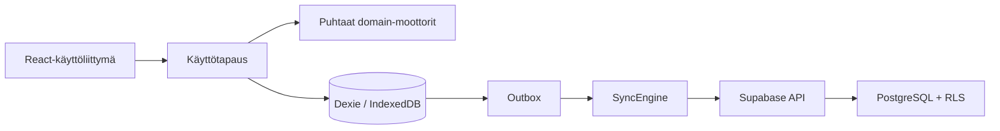

# Arkkitehtuuri

## Rajat

```text
src/
  app/                 reititys, providerit ja sovelluksen käynnistys
  features/            näkymäkohtaiset käyttötapaukset
    auth/              kirjautuminen ja tilinhallinta
  domain/              puhtaat tyypit, politiikat ja moottorit
  infrastructure/
    supabase/          asiakas, generoidut DB-tyypit ja repositoriot
    storage/           Dexie, paikallinen kirjoituspolku ja outbox
  shared/              jaetut UI- ja validointiapurit
supabase/
  migrations/          versionhallittu PostgreSQL-skeema ja RLS
  seed.sql              vain ei-arkaluonteinen kehitysdata
  functions/           palvelinpuolen Edge Functionit
  tests/               pgTAP/RLS-testit
e2e/                    selain- ja PWA-testit
docs/                   päätökset ja käyttöohjeet
```

React-komponentit käsittelevät vain esitystä ja käyttötapahtumia. Valmennus- ja
ravintopäätökset sijaitsevat omissa puhtaissa moduuleissaan:
`GoalEngine`, `ConflictEngine`, `SportAdapterRegistry`, `PlanGenerator`,
`ScheduleOptimizer`, `ReadinessEngine`, `ProgressionEngine`,
`NutritionPolicyEngine`, `ProgressEvaluator` ja `SyncEngine`.

## Selitettävä valmennuslogiikka

Jokainen valmennus- ja ravintopäätös palauttaa rakenteen
`{ decision, reasons, warnings }`. `reasons` sisältää vakaan sääntökoodin,
suomenkielisen perustelun ja päätöshierarkian tason. Päätösjärjestys on:

1. turvallisuus
2. valmentajan ohjelma, kiinteä lajikuorma ja kilpailut
3. käytettävissä oleva aika
4. päätavoite
5. sivutavoitteiden ylläpito
6. palautuminen
7. mieltymykset.

Moottorit eivät käytä verkkoa, Reactia, tietokantaa tai kielimallia. Päivämäärä,
tunnisteet ja käyttäjän vahvistus annetaan niille syötteinä, joten sama syöte
tuottaa saman päätöksen. Tavoitteen vaihto luo uuden jakson ja suunnitelmaversion
vain `GoalEngine`-esikatselun ja erillisen vahvistuksen jälkeen.

## Tietovirta

PostgreSQL on pysyvien tietojen ensisijainen lähde. Käyttöliittymä
kirjoittaa ensin IndexedDB:hen, päivittää näkymän optimistisesti ja jättää
idempotentin operaation outboxiin. Synkronointi on Reactista riippumaton.



`SyncProvider` vastaa vain elinkaaritapahtumista ja tilan näyttämisestä.
`SyncEngine`, `LocalWriteService` ja `SupabaseSyncGateway` eivät riipu Reactista.
Tarkempi työnkulku on kuvattu [offline-synkronointiohjeessa](offline-sync.md).

## Luottamusrajat

- Selainta ja kaikkia selaimesta tulevia arvoja pidetään epäluotettuina.
- Zod-validointi parantaa käyttökokemusta, mutta tietokantarajoitteet ja RLS
  ovat varsinainen palvelinpuolen suoja.
- Anon-avain ei ole salaisuus; käyttöoikeus syntyy käyttäjän JWT:stä ja RLS:stä.
- Service role ohittaa RLS:n ja sitä käytetään vain rajatuissa Edge Functioneissa.
