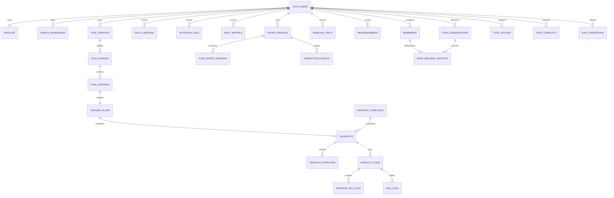

# Tietomalli

Kaikilla käyttäjäkohtaisilla tauluilla on yhteinen runko: `id`, `user_id`,
`created_at`, `updated_at`, `deleted_at` ja `version`. Muuttumattomia
`plan_versions`-rivejä ei päivitetä normaalissa käyttöpolussa.

Yhteinen liikehakemisto (`exercises`) ei sisällä käyttäjädataa. Se on
kirjautuneille luettavissa ja vain ylläpidon muokattavissa.

## Versionhallinta ja poistot

- Client lähettää nykyisen `version`-arvon; tietokanta kasvattaa arvon
  onnistuneessa päivityksessä.
- `user_id`:n vaihtaminen estetään triggerillä RLS:n lisäksi.
- Poisto merkitään ensin `deleted_at`-tombstoneksi. Fyysinen poisto on erillinen
  ylläpitotoimi.
- Vanhentunut tai push-palvelun hylkäämä laitetilaus saa tombstonen. Vain
  aktiivisen tilauksen `(user_id, endpoint)` on yksikäsitteinen, joten laite voi
  myöhemmin luoda uuden tilauksen.
- `push_delivery_receipts` on vain service rolen käsittelemä tekninen
  deduplikointitaulu eikä sisällä näkyvää ilmoitustekstiä tai terveystietoa.
- Synkronointikursori on pari `(updated_at, id)`, ei pelkkä aikaleima.
